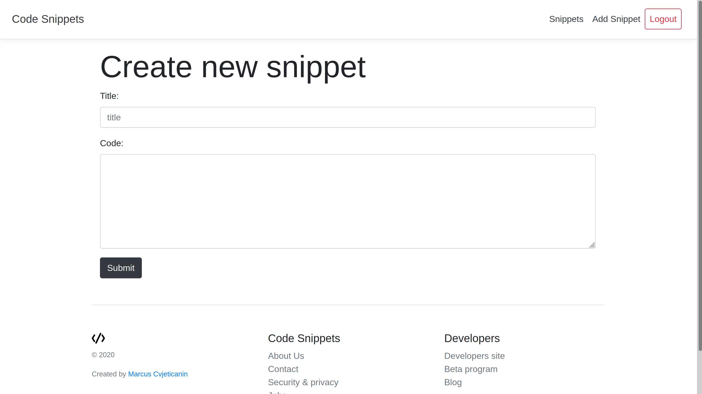

# Code Snippets

## About

A NodeJS CRUD web application for adding code snippets. It uses Express framework and Mongoose. It was built especially for a a school assignment in LNU course 1dv023.

## Screenshot

## License

The license is MIT. You are free to do whatever you want with it.
